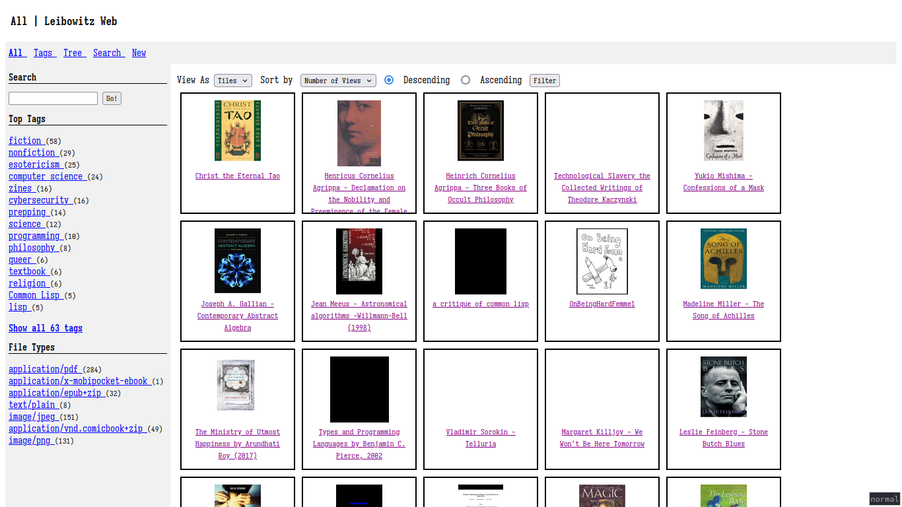
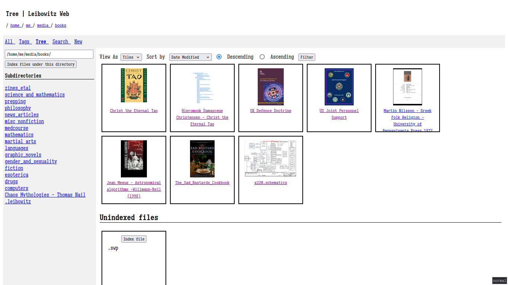
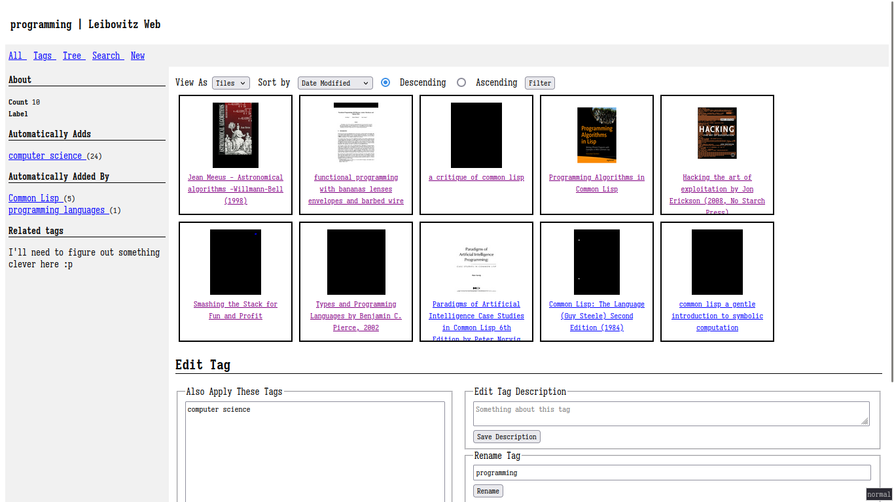
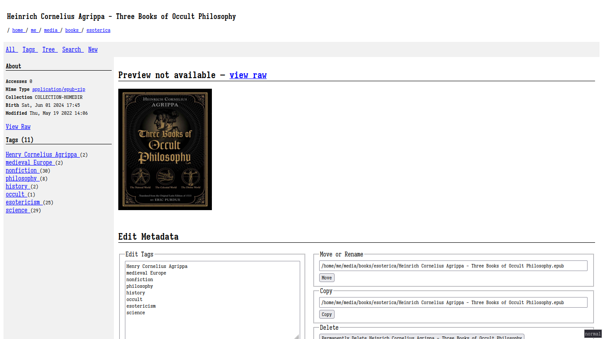

Leibowitz
=========

* [Project Homepage](https://sr.ht/~thalia/leibowitz)
* [Source Code](https://git.sr.ht/~thalia/leibowitz)
* [Bug Tracker](https://todo.sr.ht/~thalia/leibowitz)
* [Mailing List](https://lists.sr.ht/~thalia/leibowitz)

Leibowitz is my attempt at building a personal knowledge management
(PKM) platform.  It consists of a Common Lisp library exposed as a
command-line utility and a web interface that act as an abstraction
layer over the Unix file system providing the following features:

* **Tags**, which may be applied to files in a mutually-inclusive
  fashion allowing for much more granular organizational schemes than
  the mutually-exclusive Unix file system.  Tags are also hierarchical
  meaning that any given tag may have other tags as its "parents" or
  "children".  Think directories but much more flexible.
* **Full text search** of textual dumps of all indexed files.  This is
  done using a a dedicated full-text search engine fed with useful
  text extracted from files so results are more complete, have fewer
  false positives, and are presented much faster than with grep(1).
* **Extensible** and **scriptable** in Common Lisp using the symbols
  exported by the `leibowitz` package.  I take a batteries-included
  approach to development, however there's no way I can anticipate all
  use-cases so it should be relatively easy for end-users to tweak
  Leibowitz's behavior to fit the information they want to organize.
* **Friendly for Unix hackers**.  Although Leibowitz seeks to abstract
  over Unix's API in a way that's comfortable for Lisp hackers to use
  at a REPL, it is primarily intended to be used as a command-line
  tool.  As such, I have done my best to make sure it adheres the
  conventions of Unix-like systems.
* **A web interface** that consists of a somewhat primitive GUI for a
  browsing and managing a knowledge base.  It does NOT yet have any
  concept of permissions so I would strongly recommend against
  exposing it over a network unless you trust every device connected
  to it or gate it behind HTTP basic authentication with a reverse
  proxy.

At present Leibowitz is very much a work in progress and is varying
degrees of useful from a REPL, the command line, and a web UI.  **I
WOULD STRONGLY RECOMMEND AGAINST USING IT IN PRODUCTION**.

Installation and Usage
----------------------

In order to compile Leibowitz, you need to be running a Unix-like
system with make(1), the Steel Bank Common Lisp compiler, and the
[quicklisp library manager](https://www.quicklisp.org/) installed.
The ASDF build system and UIOP utility library are also needed, but
will probably already be installed along with SBCL.

In order to run Leibowitz, you need to have the SQLite3 library
installed, and have the ffmpeg, mupdf, ImageMagick, and optionally
LibreOffice programs installed somewhere in your `$PATH`.

Makefile generation requires changes to [clingon
library](https://github.com/dnaeon/clingon) that have not yet been
merged upstream, so you'll need to clone [my
fork](https://github.com/halcyonseeker/clingon) into your
quicklisp/local-projects/ directory.

You should be able to install Leibowitz quite easily with `sudo make
install`, with the default `$PREFIX` being `/usr/local/`.  Usage
information is available with `man 1 leibowitz`, which is still
admittedly sparse.

If you're familiar with Lisp, hacking on Leibowitz should be as simple
as running `(load #P"leibowitz.asd")` and `(ql:quickload :leibowitz)`.
Integration tests may be run at the command line with `make test` or
in the REPL with `(asdf:test-system :leibowitz)` (if any of them fail,
use `(parachute:test 'leibowitz/tests::name-of-test :report
'parachute:interactive)` to debug them directly).

Screenshot
----------

These examples all show a library of ebooks, mostly epub and pdf
files.

Roadmap to 0.1 version; minimum viable product
----------------------------------------------

<b>Basic requirements: DONE</b>

### Core

- [X] ~~Fix predicate/predicand bug where tags are being automatically
      applied where they shouldn't be.  This *might* be a usage error
      in web, which itself would indicate that my API is probably too
      unintuitive and in need of revision.~~  I haven't encountered
      this since so I'm almost certain I miss-used the core's API.
- [X] Common Lisp's pathname type treats certain characters (eg, `*`,
      `[`, `]`) in file names specially; figure out how to work around
      this!  This results in two different errors when calling
      `index`:
  - When such a file is in a directory that is being indexed we get
    ENOENT re-thrown up from `index-worker` in `index` (the
    error-handling currently truncates stack traces), I think this is
    caused by pathname/namestring conversion causes extra backslashes
    to be inserted at some point.
  - And when indexing it directly we get a type error
    `SB-IMPL::PATTERN is not of type VECTOR` from an `aref` call in
    `library-path-indexable-p`, I gather this is because pathname
    patterns are formed differently.

### Web

- [X] Add more error handling to the web UI!  Right now it is insanely
      easy to get this thing to crash.
- [X] Expose the full API functionality in the web frontend:
  - [X] Editing data entries:
    - [X] Adding tags
    - [X] Removing tags
    - [X] Moving/renaming
    - [X] Uploading/importing from URL
    - [X] Manually reindexing files and directories; useful /tree
    - [X] Deleting
  - [X] Editing tag entries:
    - [X] Removing data
    - [X] Renaming tags
    - [X] Editing tag description
    - [X] Adding parents
    - [X] Removing parents
  - [X] Search and listing:
    - [X] Support changing the sort order and criterion for all data
          listings
    - [X] Paginate
    - [X] Card view for more convenient browsing
  - [X] Remove use of `library-list-files-in-dir` in web; wrappers
        around `list-files` should leverage its full capabilities for
        filtering.

### CLI

- [X] The cli needs a way to normalize paths before passing them to
      the library; CL is absolutely clueless when it comes to
      resolving unix path notation.
- [X] Expose the full API functionality in the CLI interface:
  - [X] Editing data entries:
    - [X] Adding tags
    - [X] Removing tags
    - [X] Moving/renaming
    - [X] Manually reindexing files and directories
    - [X] Deleting
    - [X] Viewing data summaries
  - [X] Editing tag entries:
    - [X] Adding data
    - [X] Removing data
    - [X] Renaming tags
    - [X] Editing tag description
    - [X] Adding parents
    - [X] Removing parents
    - [X] Adding children
    - [X] Removing children
    - [X] Viewing tag summaries
    - [X] Test `-i|--invert` flag for `tag edit` subcommands
  - [X] Search and listing:
    - [X] Support changing the sort order and criterion for all data
          listings

Known Bugs
----------
- Sometimes doing a full-text search yields an error `Code CORRUPT:
  database disk image is malformed.` with the offending stanza being
  `select data.* from search left join data on data.id = search.id
  where search match ? order by rank`.  Connecting to the database and
  running `pragma integrity_check` yields okay.  Some light
  stackoverflowing indicated this might be a result damaged indexes,
  which would make sense considering it only (so far) shows up when
  doing full-text search.
- Test harness breaks when `$LEIBOWTIZ_ROOT` is set, not a big deal
  but may have led to me spending several hours chasing down bugs that
  aren't there 🙃
- Full set of page numbers how up at the bottom of query page when no
  results are returned.

Future Work
-----------

### Web

- Make sure the web UI is properly accessible and easy to use with a
  screenreader.  <https://www.w3.org/WAI/ARIA/apg/>
- Add custom CSS and JS options.
- For serving raw files in the web UI, use `Content-Disposition:
  attachement; filename=""` to preserve the filename when
  downloading...  Or perhaps fix the URL to properly encode that?
  Really, I should stop storing absolute IDs as absolute paths and do
  something with inodes and relative paths.
- Extend easy-routes to match larger chunks of the url (eg
  `/datum/@path` with `/datum/path/to/file.txt` yields `path ⇒
  "path/to/file.txt"` like in Perl's Mojolicious library.
  - Use this to reduce the amount of ugly, ugly URL parameters in the
    web fronted
- Add some concept of permissions.
- Use https://leafletjs.com with OSM data to show maps of exif
  metadata from images, display GPS log files (eg, from gpslogger),
  and maybe various GIS formats.  Will be harder in native though I
  could probably cheat by XEmbed'ing [mepo](https://sr.ht/~mil/mepo/)
  or something.
- Display spacial graphs of tag relationships?

### Core

- Add gitignore-style exclude/include patterns
- Progress and status printouts should be in the core, like with
  index, so that users can see progress of, eg, cascading up the
  predicate tree.  Should also gate all printing behind a dynamic
  variable and disable it in the test harness.  Could do something
  fancy too like pass in a custom stream and print that if there are
  problems.
- Add an inotify(7) listener to the daemon, and record inodes so that
  the indexer can catch (some) moved files.
  - Add support for similar non-Linux APIs like BSD's kqueue(2) and
    whatever the Android and win32 equivalents are.
- Store paths relative to the library root so that libraries are
  actually portable.
- Consider making the indexer run concurrently.  I think some things
  in the core are still too fiddly for this to be wise.
- **Listing and searching improvements (`list-data`, `query`,
  `list-tags`)**:
  - When listing and displaying data, we should check if the
    associated file exists on disk so that the cli and web may be able
    to easily display warnings.  This would probably best be done with
    an extra slot on the datum class.
  - Unify `query` and `list-data` into a single method that restricts
    the view of the database, then expose this in the web and cli.
    EVERY view into the filesystem should thus be trivially filtered
    using the same sets of rules.
    - Offloading search to Xapian may make this less efficient, but I
      think that would be a worthwhile tradeoff.
  - These methods should have a `:filter` argument for specifying a
    function with which to process the output; if used carefully this
    could also be used to reduce both the code and the asymptotic
    runtime complexity of the current web and command-line listing
    functions.
  - Improve full text search to index different fields (path, title,
    body, tags, tag descriptions) separately so that the user may
    selectively search in them.  I don't think this is supported by
    SQLite's FTS5, Xapian looks like a good alternative though I'll
    need to write a C shim and CFFI bindings for it.
- **More information to store**
  - Add support for `datum` subclass and collection specific metadata
    fields (eg, author, exif data, etc), probably implemented as a
    special kind of tags.
  - For an appropriate `datum` subclass, integrate with the [Internet
    Archive's API](https://archive.org/developers/index-apis.html) to
    view historical snapshots of webpages the user has saved onto
    their computer, either as a monolithic html file, a full site
    archive via, eg, `wget -np -rkEpD example.com
    example.com/somewhere`, or a .webloc or .url file.  Could also
    integrate with web archive collections like gallery-dl to link to
    historical versions of the archived document, though that's less
    useful I think.
  - Implement collections for gallery-dl archives, Unix man and GNU
    info databases, kiwix zim archives (eg, mediawiki and
    stackexchange dumps, etc.
- **Semantic analysis of tags and data**
  - Tag similarities could potentially be computed by some combination
    of:
    - Good old Levenshtein distance to catch alternate spellings.
    - Linguistic analysis, probably provided by a full-text search
      engine.  I believe Xapian exposes some of these APIs.
    - Statistical analysis of tags' data, a set of tags are probably
      pretty similar if they share a majority of data
    - Sibling tags in the hierarchy could be found by looking for tags
      whose ancestor hierarchy is similar; ie statistical analysis of
      subgraphs of the overall DAG.
  - For data similarities the best general approach would probably be
    to store vector embeddings of each datum and find the nearest
    neighbors of each, probably using the [Hierarchical Navigable
    Small World algorithm](https://arxiv.org/abs/1603.09320).  This
    could also be applied to find semantically similar tags.
  - For audio and image data we could probably use the same sorts of
    algorithms used by the likes of Shazam and Yandex's reverse image
    search to get semantic structure from non-textual data — I need to
    read up on this more.

### Miscellaneous

- Add a native GUI, probably with either TK or QT via the Clasp
  compiler's C++ FFI.
- Port to systems other than Linux and BSD and verify support for
  architectures other than 64 bit Intel.
- Leibowitz should be usable on really slow hardware and scale
  reasonably well to multi-terabyte datasets.  This will probably
  require additional backends for things like PostgreSQL, and maybe
  Apache SOLR and/or ElasticSearch.
- A CouchDB backend could maybe be used to implement an interesting
  mutli-device client/server model with aggressive caching.
- Get the client program and daemon mode working!
- Could be interesting to supplement search with a local LLM, probably
  Facebook's [Llama2](https://ai.meta.com/llama/), fed entirely by
  your local corpus.

Notes
-----
* Good UI: <https://github.com/philomena-dev/philomena> for example in
  <https://derpibooru.org/>.  Leibowitz could integrate with a tagged
  forum like Tumblr or Dreamwidth/Livejournal where each datum is a
  post with replies/comments and tags...
* Fucking SQLite FTS5 https://darksi.de/13.sqlite-fts5-structure/
* We might be able to reduce the executable's size by moving SBCL
  symbols into a shared library
  https://github.com/quil-lang/sbcl-librarian
* https://archive-it.org/post/the-stack-warc-file/
* Interesting article about categorizing data:
  https://web.archive.org/web/20050601013309/http://shirky.com/writings/ontology_overrated.html
* [Memento web protocol](http://www.mementoweb.org/about/) for
  managing web page archives
